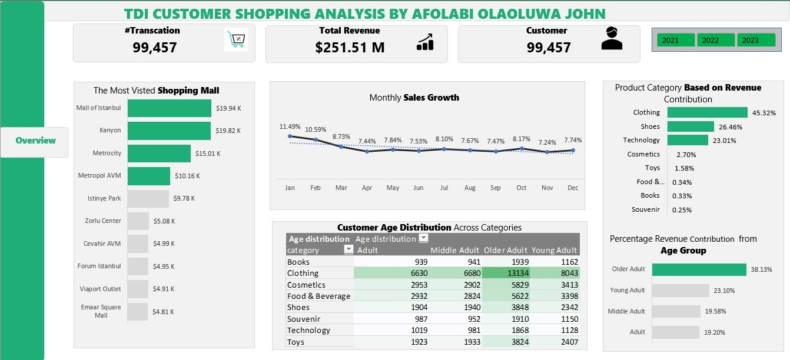
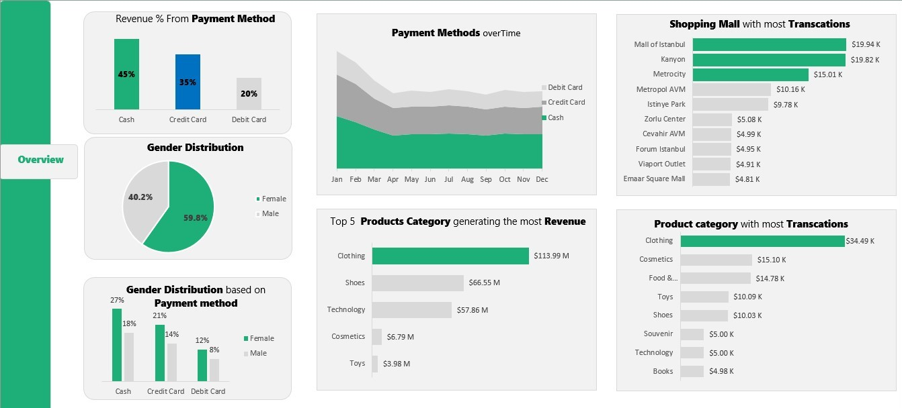

# Customer-Shopping-Analysis

# TDI Customer Shopping Analysis

## Introduction
This project provides an in-depth analysis of customer shopping behavior across various malls and product categories. The aim is to uncover insights into transaction volume, revenue, customer demographics, and payment preferences, helping businesses optimize strategies for growth and customer satisfaction.

## Problem Statement
The main challenge is to identify customer shopping patterns across multiple shopping malls and product categories and understand the contribution of various customer demographics and payment methods to the overall revenue. This analysis will help improve business decision-making and marketing strategies.

## Tools Used
- **Microsoft Excel**: Used for data processing, analysis, and visualizations.
- **Pivot Tables & Charts**: For generating insights on revenue, transactions, and customer demographics.
- **Conditional Formatting**: Applied to highlight top-performing malls and product categories.

## Data Overview
The dataset includes:
- Transaction data from various malls
- Customer demographics (age, gender)
- Payment methods (cash, credit card, debit card)
- Product categories and revenue contributions

## Key Insights
### 1. Revenue and Transactions:
- Total Transactions: 99,457
- Total Revenue: $251.51M

### 2. Most Visited Malls:
- **Mall of Istanbul**: $19.94K
- **Kanyon**: $19.82K
- **Metrocity**: $15.01K

### 3. Top Product Categories by Revenue:
- **Clothing**: 45.32%
- **Shoes**: 26.46%
- **Technology**: 23.01%

### 4. Customer Demographics:
- **Age Group Contribution**:
  - Older Adult: 38.13%
  - Young Adult: 23.10%
- **Gender Distribution**:
  - Female: 59.8%
  - Male: 40.2%

### 5. Payment Methods:
- Cash: 45%
- Credit Card: 35%
- Debit Card: 20%

## Recommendations
Based on the analysis, the following recommendations are made:
1. **Focus on Top Product Categories**: Since Clothing and Shoes generate the most revenue, efforts should be made to prioritize inventory and marketing for these categories.
2. **Target Older Adults**: Marketing campaigns should target the older adult demographic, as they contribute the most to revenue.
3. **Increase Customer Engagement in Low-Performing Malls**: Malls such as Zorlu Center and Viaport Outlet could benefit from promotional efforts to boost traffic.
4. **Leverage Cash Payment Preferences**: Although cash is the dominant payment method, offering incentives for credit card payments can increase customer loyalty.

